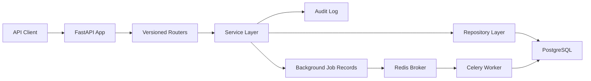

# Startup SaaS Backend

[](https://www.python.org/)
[](https://fastapi.tiangolo.com/)
[](https://www.postgresql.org/)
[](https://redis.io/)
[](https://github.com/SpyloDEV/startup-saas-backend/actions/workflows/ci.yml)

A production-style FastAPI backend for a multi-tenant SaaS product. It includes JWT authentication, workspace membership and roles, project and task APIs, audit logging, background job tracking, Dockerized infrastructure, migrations, CI, and a test suite.

This is designed as a portfolio-grade backend: the structure mirrors the kind of service a startup would use as a foundation for an internal operations tool, customer portal, or lightweight project management product.

## Features

- JWT auth with registration, login, password hashing, and current-user lookup
- Workspace system with `owner`, `admin`, and `member` roles
- Workspace-scoped project CRUD
- Workspace-scoped task CRUD with status, due dates, assignment, pagination, and filters
- Audit logs for important actions such as `user_created`, `workspace_created`, `project_created`, and `task_updated`
- Background job model plus Celery worker for task assignment notifications
- SQLAlchemy 2.0 async database layer with PostgreSQL support
- Alembic migration for the complete schema
- Docker Compose stack with API, PostgreSQL, Redis, and worker services
- Pytest suite covering auth, projects, tasks, and permission rules
- Ruff and Black formatting in local commands and GitHub Actions CI

## Architecture Overview



The app is intentionally layered:

- `api`: request routing, auth dependencies, pagination, and role guards
- `services`: business rules, audit log creation, task assignment behavior
- `repositories`: database reads and writes
- `models`: SQLAlchemy 2.0 ORM models
- `schemas`: Pydantic request and response contracts
- `workers`: Celery app and background jobs
- `alembic`: migration history
- `tests`: API-level coverage for core workflows

## Tech Stack

- Python 3.11+
- FastAPI
- PostgreSQL
- SQLAlchemy 2.0 async ORM
- Alembic
- Redis
- Celery
- JWT with `python-jose`
- Passlib password hashing
- Pytest and HTTPX
- Ruff and Black
- Docker and Docker Compose
- GitHub Actions

## Local Setup

Create a virtual environment and install the project:

```bash
python -m venv .venv
source .venv/bin/activate
pip install -e ".[dev]"
```

Create a local environment file:

```bash
cp .env.example .env
```

Update `.env` with a strong secret:

```bash
SECRET_KEY=$(openssl rand -hex 32)
```

Run migrations:

```bash
make migrate
```

Start the API locally:

```bash
uvicorn app.main:app --reload
```

Open the API docs:

- Swagger UI: http://localhost:8000/docs
- ReDoc: http://localhost:8000/redoc
- Health check: http://localhost:8000/health

## Docker Setup

Run the complete stack:

```bash
cp .env.example .env
make dev
```

Set `SECRET_KEY` in `.env` before using the stack outside local development.

This starts:

- API: http://localhost:8000
- PostgreSQL: `localhost:5432`
- Redis: `localhost:6379`
- Celery worker

The API container runs Alembic migrations before starting the server.

## Common Commands

```bash
make dev      # Start API, Postgres, Redis, and worker
make test     # Run tests
make lint     # Run Ruff and Black checks
make format   # Format code
make migrate  # Apply Alembic migrations
```

## API Examples

### Register

```bash
curl -X POST http://localhost:8000/api/v1/auth/register \
  -H "Content-Type: application/json" \
  -d '{
    "email": "founder@example.com",
    "password": "strong-password",
    "full_name": "Startup Founder"
  }'
```

Example response:

```json
{
  "access_token": "eyJhbGciOiJIUzI1NiIsInR5cCI6IkpXVCJ9...",
  "token_type": "bearer",
  "user": {
    "id": "f580ba6d-a6d9-4d56-8c58-13a9f7c3c8cb",
    "email": "founder@example.com",
    "full_name": "Startup Founder",
    "is_active": true,
    "created_at": "2026-04-28T12:00:00Z"
  }
}
```

### Create a Workspace

```bash
curl -X POST http://localhost:8000/api/v1/workspaces \
  -H "Authorization: Bearer $TOKEN" \
  -H "Content-Type: application/json" \
  -d '{"name": "Acme Operations"}'
```

### Create a Project

```bash
curl -X POST http://localhost:8000/api/v1/workspaces/$WORKSPACE_ID/projects \
  -H "Authorization: Bearer $TOKEN" \
  -H "Content-Type: application/json" \
  -d '{
    "name": "Customer Onboarding",
    "description": "Build the first version of the onboarding workflow."
  }'
```

### Create an Assigned Task

```bash
curl -X POST http://localhost:8000/api/v1/workspaces/$WORKSPACE_ID/tasks \
  -H "Authorization: Bearer $TOKEN" \
  -H "Content-Type: application/json" \
  -d '{
    "project_id": "'"$PROJECT_ID"'",
    "title": "Send welcome email template",
    "status": "todo",
    "due_date": "2026-05-10",
    "assigned_to_id": "'"$USER_ID"'"
  }'
```

### Filter Tasks

```bash
curl "http://localhost:8000/api/v1/workspaces/$WORKSPACE_ID/tasks?status=in_progress&project_id=$PROJECT_ID&limit=20&offset=0" \
  -H "Authorization: Bearer $TOKEN"
```

Example response:

```json
{
  "items": [
    {
      "id": "96902e06-08cc-4f14-b4dc-a91e1088a93b",
      "workspace_id": "f119f132-7ff5-4f16-b23f-f6d3c5a4b5fd",
      "project_id": "0f20ed60-1f7f-4867-9fd1-f0ff6ad5168d",
      "title": "Send welcome email template",
      "description": null,
      "status": "in_progress",
      "due_date": "2026-05-10",
      "assigned_to_id": "e785c147-48cb-4e35-b0c1-8ad63845fa11",
      "created_by_id": "f580ba6d-a6d9-4d56-8c58-13a9f7c3c8cb",
      "created_at": "2026-04-28T12:02:11Z",
      "updated_at": "2026-04-28T12:04:30Z"
    }
  ],
  "total": 1,
  "limit": 20,
  "offset": 0
}
```

## Folder Structure

```text
.
├── app
│   ├── api
│   │   └── v1
│   ├── core
│   ├── db
│   ├── models
│   ├── repositories
│   ├── schemas
│   ├── services
│   └── workers
├── alembic
│   └── versions
├── tests
├── .github
│   └── workflows
├── docker-compose.yml
├── Dockerfile
├── Makefile
└── pyproject.toml
```

## Testing

Run the test suite:

```bash
make test
```

Run lint checks:

```bash
make lint
```

The CI workflow runs Ruff, Black, and Pytest against a PostgreSQL service.

## Why This Is Useful For Startups

Most SaaS products need the same backend foundation before they can ship customer-specific value: users, teams, permissions, durable data, background work, auditability, tests, and deployable infrastructure. This project packages those primitives in a clean, extensible structure so a team can add billing, invitations, analytics, domain-specific workflows, or admin tooling without rewriting the core backend.

## Security Notes

- Passwords are hashed before storage.
- JWT secrets are read from environment variables.
- Workspace access is enforced by dependencies and role checks.
- Secrets are not committed. Use `.env.example` as a template only.
- Background jobs are disabled by default in tests and enabled in Docker Compose.
